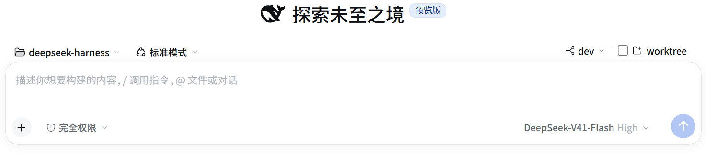
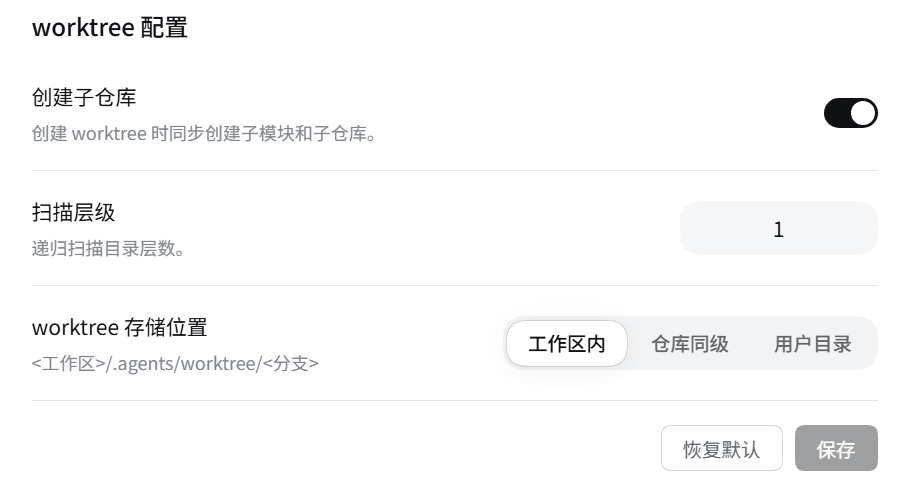

# @guowenzhang/dsh-worktree

[English](README.md) | 中文

## 背景：DeepSeek Harness

DeepSeek Harness（`dsh`）是 DeepSeek AI 开源的 agent harness，几乎所有能力都是 [Cordis](https://github.com/cordiverse/cordis) 插件。它处于 **developer preview** 阶段、迭代很快，会有破坏性变更（[文档站](https://deepseek-harness.github.io/deepseek-harness/)，`0.1.7-alpha.*`）；本插件是独立第三方包，`@deepseek-ai/*` 运行时从宿主解析。

## 这个插件解决什么问题

DSH 的会话工作目录在创建时冻结，想在独立 Git worktree 里干活就得手工建 checkout 再开会话；本插件在新会话界面勾一下就做完这两件事。

## 截图


在 `选择工作区 / 模式` 那一行右端勾上 `worktree`，就建好 checkout 并把会话开在里面。


设置 → Worktree：创建子仓库、扫描层级、worktree 存储位置，右下角是 恢复默认 / 保存。

## 安装

```sh
npx @deepseek-ai/dsh plugin --profile web add @guowenzhang/dsh-worktree
```

来自 npm 官方源：<https://www.npmjs.com/package/@guowenzhang/dsh-worktree>。装完重启宿主；本地目录开发安装、git 源与排查见 [AGENTS.md](AGENTS.md)。

## 用法

### 在新 worktree 里开始会话

在 Git 仓库里开**新会话**时，`选择工作区 / 模式` 那一行的右端出现一个胶囊：`⑂ <分支> ▾ │ ☐ <新建工作区图标> worktree`。左边是**本地分支下拉**——新分支从哪个本地分支开始，默认是当前会话所在 checkout 的分支，取不到就是 `HEAD`。列表在打开菜单时才去读，按最近提交排序，只列 `refs/heads`：远端分支或 tag 会让 `git worktree add` 悄悄进 detached HEAD，所以不给选。界面不提供分支名输入。

勾上 `worktree` 那一段就是全部动作，它按顺序跑四步：用 `git worktree add -b <branch> <path> <base>` 在**主仓库**上建 checkout（会话即使已经在某个 linked worktree 里，也会回溯到主仓库）；把新目录注册成一个工作区；用新目录作为 `meta.cwd` 启动会话；把该会话挂进工作区的账本——会话只通过这本账归属工作区，不挂的话它在 GUI 里是“未分组”，`选择工作区` 也没有名字可显示。之后浏览器再刷新一次会话目录并切到该会话：新会话是 Host 在**客户端 Session Controller 之外**创建的，不先拉一次目录，导航会以 `unknown session` 拒绝这个 id。

**勾选是单向的**：勾上就执行创建并开启会话，没有任何路径把它取消勾选。失败分两种。**Host 拒绝**（分支名冲突、不是仓库等）什么都没建：控件回到未勾选并显示原因，再勾是重试。**建好了但没切过去**（导航失败）时控件记住那个新会话，再勾是把它打开，不会建第二个 checkout。

**每个会话独立、且不可更改**：会话的工作目录是创建时冻结的头字段，所以这个控件只在会话还是空白（没跑过第一轮）时出现。这是设计约束，不是缺陷——想换目录只能新开会话。

### 控件什么时候出现

控件状态跟着会话和它所在目录走：

| 状态 | 控件 | 原因 |
|---|---|---|
| 空白会话，目录在主 checkout 里 | 可操作 | 选择还开着 |
| 会话已在某个 linked worktree 里 | 显示但锁住（base + 已勾选） | 它已经隔离好了；再给一次会在一个 checkout 里套出下一个 |
| 会话已跑过至少一轮 | 隐藏 | `header.cwd` 已冻结，Host 会拒绝 |
| 目录不是 Git 仓库 | 隐藏 | 没有可隔离的仓库 |

锁住的控件不提供任何更改——两段都禁用、chevron 收起，悬停提示当前 checkout 实际所在的分支。页面刷新会丢掉“这个 checkout 是我建的”这层记忆，所以锁住的控件显示该 checkout 自己的分支；分支名本身就是 `<base>-<6 位随机数字>`，来源照样看得出来。

### 选择 checkout 存放位置

**设置 → Worktree**，标题「worktree 配置」，三行，都是设置列一贯的左标签 / 右控件式：

- **创建子仓库** —— 默认关。打开表示 checkout 记录的子模块、以及嵌套在它里面的仓库都跟着一起创建；关闭表示只建父仓库自己。
- **扫描层级** —— 从仓库根往下找嵌套仓库的目录层数，默认 1（直接子目录）。未打开**创建子仓库**前这一行是禁用的。
- **worktree 存储位置** —— 工作区内 / 仓库同级 / 用户目录，该行说明文字显示所选位置解析出的目录。

右下角 `[恢复默认] [保存]` 放在一起，保存即生效、不需要重启宿主——新策略会装回正在运行的服务实例上。离开页面会丢弃所有暂存改动。

| 值 | 界面 | 目录 |
|---|---|---|
| `agents`（默认） | 工作区内 | `<工作区>/.agents/worktree/<分支>`，出现在工作区树里 |
| `sibling` | 仓库同级 | `<仓库名>-wt-<分支>`，建在仓库旁边，不进工作区树 |
| `home` | 用户目录 | `~/.agents/worktree/<分支>`，整台机器共用 |

### 让模型操作 checkout

三个模型工具消费同一个服务，都不开会话——模型建出 checkout，由产品自己的新会话流程把会话放进去。`worktree_create` 建一个 linked checkout 并返回它的路径；`worktree_list` 列出该仓库的 checkout，主 checkout 在最前；`worktree_remove` 删除其中一个，拒绝主 checkout，也拒绝任何带未提交改动的 checkout，除非显式传 `force`。

```js
// 一个会话里
worktree_create({ branch: 'fix/123' })
worktree_list()
worktree_remove({ path: '/abs/path' })
```

### 分支名

界面不收分支名，由 Host 推导：**所选 base 分支名（`/` 换成 `-`）+ 6 位随机数字**，例如 `dev-482913`；base 不是本地分支（`HEAD`、某个 SHA、`origin/x`）时用 `worktree-<6 位随机数字>`。base 本身不落盘，但照样看得见——工作区标题、checkout 目录、`git branch` 都带着这个生成出来的名字。

## 注意事项

- **不自动清理。** 会话结束后 worktree 不会自动删除：未提交的工作绝不该被静默丢弃，删除只能显式发起。
- **删除不检查 live 会话。** 删除一个仍有会话在跑的 checkout 目前不做拦截。
- **6 位随机后缀会撞名。** 同一个 base 的两个 checkout 取自同一个空间，约百万分之一会撞上；那时 `git worktree add` 会直接报错，再勾一次即可。
- **默认位置会出现在 `git status` 里。** `agents` 把 checkout 放在 `<工作区>/.agents/worktree/` 下，是主 checkout 里的未跟踪目录。把 `.agents/worktree/` 加进 `.gitignore` / `.git/info/exclude`，或改用 仓库同级 / 用户目录。
- **「用户目录」是整机共享的位置。** `~/.agents/worktree/<分支>` 不属于任何工作区：几个仓库的 checkout 会并排放在一起；它落在某个仓库里时，那里也需要你自己加 `.gitignore`。
- **不能从界面给分支起名。** 分支在工作区标题里可见；需要指定名字就用 `worktree_create` 的 `branch`。
- **子模块是 detached HEAD，这是设计。** 这是 gitlink 的语义，不是缺陷；要“带分支的子仓库”就用独立嵌套仓库。
- **只有真正的 `.git` 目录才算嵌套仓库。** 一个子目录如果自己是别的仓库的 linked worktree（`.git` 是文件），或者是个子模块，都不会被镜像成新分支。
- **本地路径的子模块需要 Git 的 `file` 传输许可。** `protocol.file.allow` 是 Git 自己的安全开关，本插件**不覆盖**它：仓库的 `.gitmodules` 指向本地路径时，得由 git 配置（全局或仓库级）放行，否则创建会带着 Git 的原话失败并整体回滚。子模块用 https/ssh 时不受影响。
- **删 checkout 不会删分支。** worktree 的分支——包括为嵌套仓库建的、活在它们自己仓库里的那些——都会在删除后留下，和工作区自己的分支一样。
- **记忆共享，文件与授权不共享。** `dsh-memory` / `dsh-claude-compat` 会把 linked worktree 的 `{project}` 回溯到主仓库，所以同一仓库的所有 worktree 共享一份记忆，而文件与沙箱授权各自独立。这是有意的：隔离的是文件和授权，共享的是知识与上下文。

## 许可

插件本体是 Apache-2.0——见 [LICENSE](LICENSE) 与 [NOTICE](NOTICE)。

它不包含 DeepSeek Harness 的源码：harness 包是 peer 依赖，运行时从宿主解析。

## 延伸阅读

- [AGENTS.md](AGENTS.md) —— 安装变体、构建、组合接线、生效语义、发版步骤、设计决策、排查与测试运行方式。
- [dsh-memory](https://github.com/zhang-guo-wen/dsh-memory) —— 姊妹记忆插件，它的 `{project}` 解析让同一仓库的所有 worktree 共享一份记忆。
- [DeepSeek Harness 文档](https://deepseek-harness.github.io/deepseek-harness/)。
